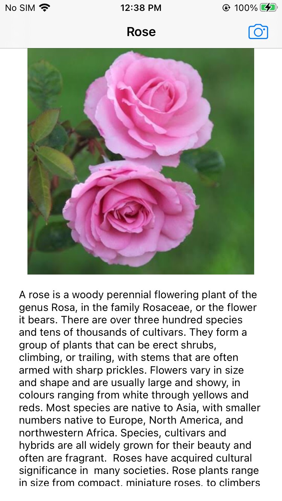

# Flower-Classification

IOS Application---

Used Oxford 102 flower dataset to train model and used the trained model to classify flowers.

Also, using Alamofire, made a request to wiki to get the details of the predicted flower name and showed below the image.

